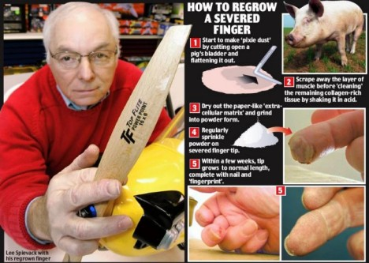
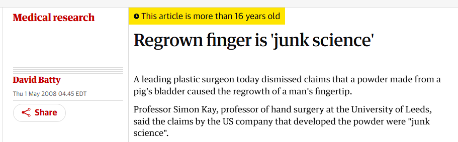
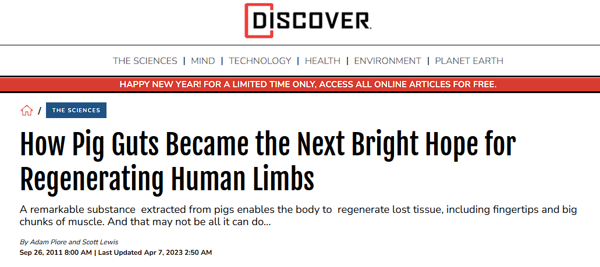
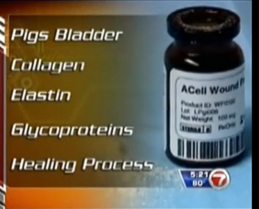
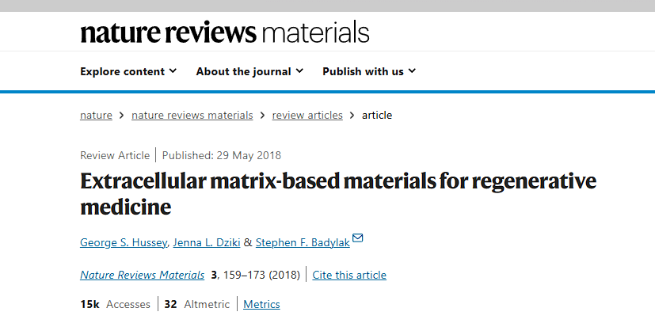
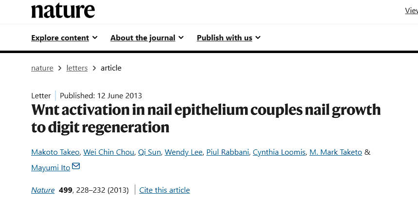
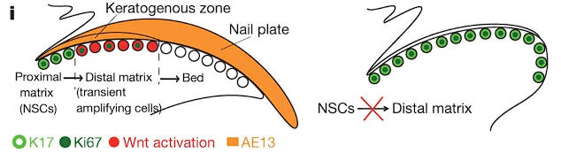
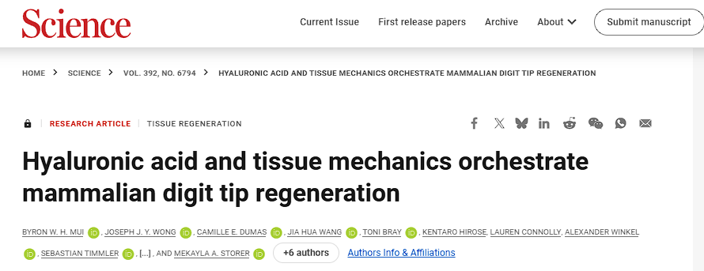
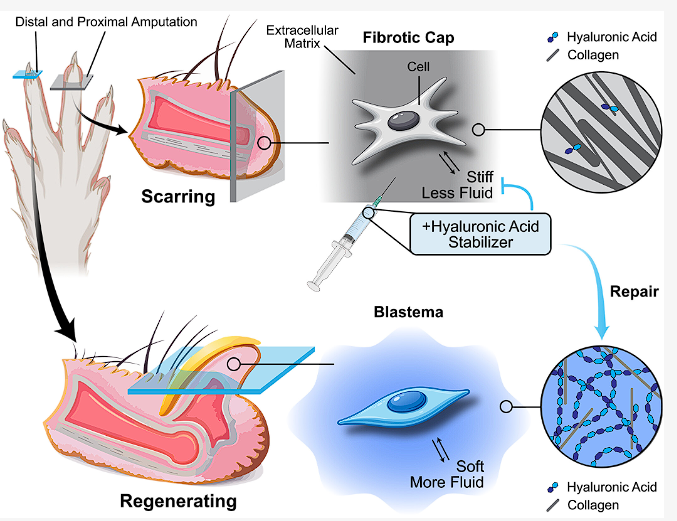

## 让断指实现再生的神奇粉末是科学还是骗局

<em>1.困惑的记忆</em>

一个白人男子在镜头前轻轻揭开绷带，暴露出一截断掉的，可以用血肉模糊来形容的手指。接着医生将一种白色粉末撒在了伤口上，经过一段时间后再次拆开绷带，断掉的手指竟奇迹般地重新长了出来。

笔者的童年记忆中一直存在上述一幕，似乎是来源于纪录片或者纪实节目中的片段。这种近乎是将奇幻故事中的魔法变为现实的故事给我带来了困惑：断指再生这件事情与我浅显的认知是互相矛盾的，毕竟现实生活中没有人见过断掉的手指能够自己再长回来。很快，这件事情在我的脑海中被搁置到了角落，正如许多其他的儿时古怪想法一样吃灰，甚至让人回想起来的时候会怀疑它是否是记忆的凭空捏造。

22岁那年，大学毕业的我进入了一所专门研究再生与发育的实验室继续学习，彼时一度与肢体再生小组的大师兄走得挺近，我们经常一起在3DS上抓宝可梦，玩乐器，录歌，还参加过小型的快闪演出。此外，我们也会聊很多关于再生相关的话题，一次谈及做研究的兴趣的时候，我提起了记忆角落里的那部影片，我并不抱希望地问他是否知道有这么一回事，没想到他说：“我知道这部纪录片，他们用的是猪膀胱”。那一刻我意识到，原来自己记忆中的奇迹并非源自大脑的杜撰，而是切实存在的。他说，这部纪录片是他对再生感兴趣的启蒙。或许对于我自己而言，这部纪录片也在冥冥之中引导了我对于当时研究方向的选择。很可惜，我们都忘记了那部纪录片的名字，相同的经历再度勾起了我的好奇心，并决定挖掘这件事情的来龙去脉。

<em>充满争议的神奇粉末</em>

美国售货员Lee Spievack被模型飞机的螺旋桨意外削断了指尖，在一种由猪膀胱为原料提取的神器粉末的治疗后，指尖恢复如初，这一事件被当时的媒体争相报道

2005年8月的一天，68岁的美国售货员Lee Spievack在向顾客演示一架模型飞机时发生了意外，模型飞机高速运转的螺旋桨削去了这位老人的中指指尖。对于婴儿来说，意外损失指尖尚有再生的可能性，这是哺乳动物幼体时期所普遍具有的再生能力，然而这种再生能力会随着发育丧失，换句话说，成年人若损失了指尖就无法再生，何况Lee已经68岁。正如其他类似的患者一样，Lee被送往医院，接受了医生的清创和包扎处理，只不过事情的后续发展与通常有些不同。

Lee Spievack的兄弟Alan Spievack曾任哈佛医学院的助理教授，如今成立了一家名为ACell的公司，主要生产一种概念性的产品——一种由猪膀胱为原料提取的白色粉末，号称能够促进再生。Alan向Lee提供了这一粉末，嘱咐他定期涂抹到伤口处，结果不到4周时间，Lee的断指便神奇地长到了原来的长度，并在4个月后完全恢复如初。这一神奇事件被当时的各媒体争相报道，在大众传媒中，白色粉末普遍被赋予了一个带有奇幻性质的名字——魔法精灵粉（magical pixie dust）。这一叙事被报道为“年度医学突破”——只不过是在《Esquire》杂志上，相当于上了小红书的热搜榜或者拿了《故事会》的奖，属于是热闹至极但份量不重。

Simon Kay在《卫报》上发表了一篇公开评述，称手指再生是垃圾科学

在大众一片叫好中，对于魔法精灵粉的功效，业内却不乏反对的声音。其中最知名的质疑者是利兹大学手部外科学教授Simon Kay，他在《卫报》上发表了一篇公开评述，尖锐地声称ACell在搞“垃圾科学（junk science)”。他在看了报道过程中的照片后表示：“这是一个荒谬的故事——极度荒谬且夸大其词”，因为在他看来这一伤势并不严重，“看起来只是普通的指尖伤，愈合情况相当平淡。所有伤口都会经过修复过程。”最后他还锐评道：“如果你真的能够实现（他们声称的）那种程度的再生，你的第一想法应该是把结果发表在严肃的科学期刊，例如《自然》杂志上，因为这将是一场诺贝尔奖级别的革命”

<em>——&quot;If you could regenerate body parts like this, your first port of call would be a serious science journal like Nature because it would be a Nobel prize winning revolution.&quot;</em>

Discover的一篇报道“猪的肠道如何给人类肢体再生再次带来曙光”；媒体报道的ACell微基质产品的主要成分

争议并没有阻碍ACell公司产品的正式亮相，魔法精灵粉最终以微基质(MicroMatrix<strong>®</strong>)/伤口敷料（ACell wound powder）的名字，以医疗器械的名义进入了医疗市场。可以注意到的细节是，这一产品最终的商品名并不像之前媒体报道一般激进，丝毫未提“再生”二字。此外，这款伤口敷料的主要成分也被公布：胶原蛋白Ⅰ，胶原蛋Ⅲ，胶原蛋白Ⅳ——提取于猪膀胱的一些细胞外基质（以下简称ECM)。这听起来可能有点令人扫兴，无论是现在还是当时的大众都多少知道胶原蛋白这东西，它是哺乳动物体内含量最多的一类蛋白质，无法被人体直接吸收，其名字来源于早期人们获得胶水的方式——通过煮沸动物的皮肤、肌腱等组织，提取出其中具有黏性的胶原蛋白，它的存在如此之广泛，可以说我们每天都在从食物里摄入它。

那么问题来了，ECM是否真的具有启动再生的能力？这个问题的答案在当时其实是含糊的。从Alan Spievack早期在哈佛医学院参与发表的学术论文来看，他一直都对ECM参与组织再生情有独钟，但Alan Spievack的学术生涯似乎一直不温不火，而后离开学术界投身产业创立公司这一行为则实锤了他作为推崇ECM商业化的激进派的一面。可以推测的是自家亲兄弟手指偶然受伤的事件恰好给了公司产品一个宝贵的营销机会，因此在Lee Spievack使用粉末期间才能留下生动的记录，从而给媒体报道关注提供了丰富的材料。我们大概可以得出推论，伤口粉末的成功上市与爆火，是一场精妙的商业策略与轰动性公关事件完美碰撞。为了规避新药审批动辄十余年的漫长周期与巨额成本，企业巧妙且合规地将其定位为医疗器械，从而拿到了快速进入市场的通行证。随后发生的Lee Spievack断指再生事件通过媒体报道，使其瞬间完成了极其昂贵的全球市场教育。

我们很难用一句话来定论伤口粉末是否单纯是一个骗局，它的上市流程完全合规，但又主动规避了用途和功效上作为“药品”的属性，其真实的疗效从来没有经过任何的严谨临床实验验证，然而大肆的媒体夸张报道却让人们相信，它就是能够让奇迹发生的神药——以后来者的视角来看，其实类似的营销手段在如今早的保健品、中成药以及美妆领域已屡见不鲜。

<em>3.营销之外的科学新证</em>

把时钟从“答案含糊”的那一年拨到今天，再回头看这捧白色粉末，会发现它其实并不那么像魔法，而更像一座“被拆空了细胞的建筑脚手架”。要理解它，得先把第二部分里那个笼统的“胶原蛋白”说得更准一点。

细细胞外基质为基础的再生药物已经具有相当规模的临床应用，同时也是再生医学的热点研究方向。图中为权威期刊nature reviews materials刊登的综述。

细胞外基质（extracellular matrix，ECM）并不是某种单一物质，而是细胞为自己搭建的“非细胞成分”总和：胶原蛋白、层粘连蛋白、纤连蛋白、蛋白聚糖，以及一大类被“藏”在其中的生长因子，共同组成一张三维的信号网络。它既是结构支架，也是细胞之间传递指令的介质。美国匹兹堡大学 McGowan 再生医学研究所的 Stephen Badylak 团队，是这套思路的奠基者：他们取动物来源的组织（比如猪膀胱 UBM、猪小肠黏膜下层 SIS），用“脱细胞”工艺洗掉其中会触发免疫排斥的细胞成分，只留下这张天然的“脚手架”，做成可降解的生物支架。ACell 那捧白色粉末，本质上就是磨碎、脱细胞后的猪膀胱细胞外基质。

那么这张脚手架凭什么改写了愈合的结局？秘密在于哺乳动物伤口愈合的默认剧本。一块组织受伤后，身体会走一条高度保守的路线：止血、炎症、增殖、重塑，最后用瘢痕组织把伤口“补上”——能用，但不完美。Badylak 在 2007 年提出的核心概念叫“建设性重塑”（constructive remodeling）：一张配置得当的 ECM 支架，能把这条默认路线从“结疤”扭转为“长出部位相称的功能性组织”。而决定结局的关键，不在于支架本身多结实，而在于它能否被快速、彻底地降解，并在降解中释放出有生物活性的分子。

这就引出了第二个机制。ECM 被酶解时，会暴露出原本折叠在蛋白质内部、平时看不见的短肽片段，学界称之为“基质隐肽”（matrikine / matrikryptic peptide）。这些只有几 kDa 到十几 kDa 的小分子，像被解封的指令，对血管内皮细胞、周血管干细胞、神经前体细胞具有趋化活性，能把身体里游走的干细胞和前体细胞“招募”到伤口处参与重建。一个和本文主题格外对味的发现是：Agrawal 等人在成年哺乳动物的断指损伤模型里观察到，ECM 植入处出现了 Sox2+ 的原始细胞——这类细胞正与组织的再生潜力相关。换言之，粉末里并没有“造指的细胞”，它招来的，是宿主自己的细胞。

第三个机制，可能是整件事里最妙的——ECM 对愈合的改写，很大程度靠“调教”免疫系统完成。植入后早期，伤口会涌入中性粒细胞与巨噬细胞；而充分脱细胞、未做化学交联的支架，会在数天到两周内，把巨噬细胞从一个促炎的 M1 表型，切换成抗炎、促修复的 M2 表型。这种以 M2 为主的微环境，直接关联血管新生、干细胞招募与组织重建；反过来，脱细胞不净或做了交联的支架会卡在持续的 M1 炎症状态，最终还是走向结疤。妙处在于：近年研究发现，巨噬细胞同样是蝾螈断肢再生的必需角色——有团队清除蝾螈体内的巨噬细胞后，再生失败、代之以大量瘢痕。ECM 支架所倚仗的 M2 免疫重编程，与低等动物再生的免疫开关，竟是同一条线索的两端。

小鼠指尖的近端存在一群类甲干细胞NSCs（绿色的部分）——Takeo, M., Chou, W., Sun, Q. et al. Wnt activation in nail epithelium couples nail growth to digit regeneration. Nature 499, 228–232 (2013).论文中的配图

那么，它真的能让断指“长回来”吗？这里要回到一个常被忽视的事实：哺乳动物（包括人）本来就能再生指尖——前提是保住足够的甲母质。2013 年，纽约大学 Mayumi Ito 团队在《自然》发文指出，指甲根部的甲母质里驻扎着一类甲干细胞（nail stem cells）；截肢后，这一区域被激活 Wnt 信号通路，进而招来神经，神经再通过 FGF2 等分子驱动间充质细胞形成“再生芽基”（blastema），大约五周便恢复如初。可一旦截得太靠后、甲母质损失过多，Wnt 通路无法启动，再生就失败。这条通路与蝾螈再生的 Wnt/FGF 信号高度相似，提示人类仍部分保留着祖先的再生程序，只是被“锁”在了指尖这一小片区域。Lee Spievack 的伤恰好发生在指甲所在的远端——正落在哺乳动物天然具备再生能力的范围内。ECM 粉末在这里扮演的，更像是“帮把手”：抑制瘢痕、提供支架、改善局部免疫微环境，把身体本就脆弱的指尖再生潜力托住、放大，而不是凭空造出一根新手指。

小鼠指尖截断实验是个很好的对照模型，截断位置不同，造成的结果完全不一样：一个走向纤维化（留疤），一个能再生。近端截断的话，由于细胞外基质胶原蛋白堆积、组织变硬，最后会导致结疤；远端截断就不一样，依靠靠透明质酸丰富、柔软丰富的ECM，最后能够真正再生出新的指尖。作者提出，针对导致疤痕的ECM做文章，改变它的力学特性，手指就能恢复再生能力。——Byron W. H. Mui et al. ,Hyaluronic acid and tissue mechanics orchestrate mammalian digit tip regeneration.Science392,eady3136(2026).论文中的配图

2026 年发表于《Science》的一项研究把“为什么只有指尖能再生”的解释又推深了一层。Mui 等人在小鼠断指模型里直接对比了“能再生”与“结疤”两类伤口：能再生的远端伤口，组织柔软、富含透明质酸（hyaluronic acid, HA）；而不能再生的近端伤口，则又硬又满是致密的胶原蛋白。透明质酸在这里并非被动的填充物——它会主动抑制胶原蛋白的组装，从而压住瘢痕化的僵硬环境；实验里一旦耗竭 HA，再生就中止、瘢痕取而代之，而用 HAPLN1 连接蛋白把 HA 网络“稳住”，即便在本来会永久结疤的近端截肢处也能重新唤起骨的修复。这给前述的 Wnt/甲母质故事补上了一个力学维度：ECM 不只是一张化学信号网，它的“软硬”本身就是再生与结疤的开关。那捧粉末想提供的，正是一张柔软、可降解、富含基质的支架——在原理上，与这项研究指向的“把僵硬的瘢痕环境重新调软”不谋而合。

摘掉营销滤镜，我们能给出的判断是：这捧粉末背后的科学，不是骗局，但也远非媒体渲染的“魔法精灵粉”。脱细胞 ECM 生物支架是一门经过大量同行评议检验的正经技术——UBM 类材料早在 2009 年就获 FDA 批准用于伤口与软组织修复并投入临床，相关论文逾百篇，ACell 也于 2021 年被 Integra LifeSciences 以 4 亿美元收购。它的真实本领，是“以功能性组织替代瘢痕”的伤口修复平台，而非“让任意断肢重生”的奇迹药。至于 Lee Spievack 那根手指，它更像是一个落在身体再生能力边界之内、又被支架适度助力的个例——动人，却远未达到“诺贝尔奖级革命”所需的、经严格对照验证的证据。科学新证能撑起它的潜力，却撑不起当年的夸张宣传。类似的事件不断的拷问我们：无数跳过临床实验，通过其他方法规避法条来快速上市的擦边药，到底应当被推崇为推动医学应用的先驱，还是单纯的资本游戏。

